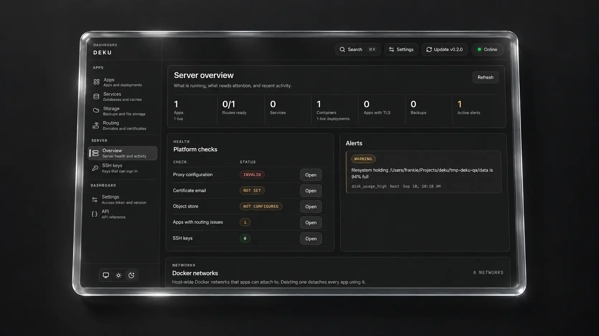

# Deku

<p><sub>Linux amd64 release artifacts: <code>deku</code> 11.4 MB, <code>dekud</code> 20.5 MB, dashboard bundle 1.3 MB</sub></p>

<p align="center">
  
</p>

Deku is a lightweight self-hosted PaaS for deploying and operating applications on your own server.

It combines:

- A Rust CLI: `deku`
- A Rust daemon: `dekud`
- Docker for app and service containers
- Angie for routing and TLS
- A built-in dashboard served directly by the daemon

## Features

- **Deploy any source**: a source directory, a pre-built image, or a `git push` over SSH
- **Starter templates**: local framework templates adapted for Deku deploys
- **Rollback**: every deployment is retained and can be restored
- **Environments**: staging, preview, and other targets with their own config overrides
- **Readiness gating**: a web replica must pass its health check before it receives traffic, and every ready replica serves
- **Remote builds**: offload image builds to a separate host, or force a local build for one deploy
- **Config vars**: app-wide or per-environment, encrypted at rest
- **Domains and TLS**: attach hostnames and get certificates automatically
- **Process management**: set replica counts, memory, and CPU limits per process type
- **Runtime access**: run a one-off command in a fresh container, or inspect a running one
- **Logs**: stream and search build and runtime output
- **Scheduled jobs**: run commands on a cron schedule
- **Networks and storage**: attach shared Docker networks and persistent mounts
- **Traffic control**: serve a maintenance page, redirect individual paths, and put HTTP basic auth or forward auth in front of an app
- **Managed services**: provision Postgres, MySQL, MariaDB, Redis, and MongoDB, link them to apps, and back them up on demand or on a schedule
- **Dashboard**: the whole surface above is available in the browser, served by the daemon itself
- **Diagnostics**: check host health with `deku doctor`
- **Alerts and metrics**: active alerts and daemon metrics, exposed as a Prometheus endpoint
- **Lifecycle hooks**: post build, deploy, and app events to an HTTP endpoint, and gate a deploy on the response
- **CLI and API**: the full `deku` command surface, an HTTP API, and an OpenAPI 3.1 reference at `/api/docs`

## Quick Start

Requirements:

- Linux server with `apt-get` available
- Ubuntu 22.04+ or Debian 11+
- Docker Engine 24+ and the `docker` CLI on `PATH`
- 512 MB RAM minimum
- Root access

Install on the server:

```bash
curl -fsSL https://get-deku.vercel.app/install.sh | sudo bash
```

After install:

```bash
deku dashboard
deku apps create my-app
deku deploy run my-app --path /absolute/path/to/app
```

Useful follow-up commands:

```bash
deku apps info my-app
deku deploy list my-app
deku logs my-app -n 100
deku ps list my-app
deku checks run my-app
deku checks routing my-app
deku doctor
```

New installs bind Deku's optional SSH deploy server to port `2222`, so it does not collide with a host `sshd` on port `22`. CLI and API deploys do not use the SSH listener.

## Dashboard

The dashboard is served by `dekud` itself, and it links to the interactive API reference.

```bash
deku dashboard
```

That prints the server-reachable URL, the loopback URL for on-host access, the config path, the token status, SSH tunnel and firewall guidance for remote access, and the command to mint a replacement token. The initial token is shown once during `deku setup`.

The dashboard and the authenticated HTTP API listen on TCP port `2810` by default. If your browser is on another machine, use the printed SSH tunnel command or allow `2810/tcp` through your firewall.

## Managed Services

Deku includes first-party workflows for Postgres, MySQL, MariaDB, Redis, and MongoDB. You can create, link, inspect, back up, and tail each one from the CLI or the dashboard.

All three support backups through the configured object store:

- On demand, with `deku postgres backup`, `deku redis backup`, or `deku mysql backup`
- On a schedule, with retention applied automatically: `deku backup schedule <service> --interval-hours 24 --keep 7`

Run `deku objectstore test` first. Backups fail without a working object store.

## Deploy Model

- Image deploys: `deku deploy run <app> --image <ref>`
- Source deploys: `deku deploy run <app> --path <dir>`
- SSH `git push` deploys: a supported secondary path
- Remote builds: an operator can offload builds to a separate host, and run `deku deploy run --build-host local` to override it

Starter templates live under [`templates/`](templates/) and are adapted for Deku's `dockerfile` and `railpack` builders.

Put migrations in a `release:` entry in the image's Procfile. It runs on every deploy, and a failure fails the deploy, so a broken migration never reaches the running app.

Rollout behavior is controlled by `deku.toml`, and Deku applies these values during the deploy rather than storing them as metadata:

```toml
[deploy]
healthcheck = "/health"
port = 3000
wait = 5
timeout = 30
attempts = 5
retire = 60
```

## Documentation

The documentation is published at <https://get-deku.vercel.app/>:

- [Installation and uninstall](https://get-deku.vercel.app/installation/)
- [Get started](https://get-deku.vercel.app/get-started/) with the first app and deploy
- [Traffic control](https://get-deku.vercel.app/traffic-control/) for maintenance mode and redirects
- [Deploy tokens](https://get-deku.vercel.app/deploy-tokens/) for deploying from CI without the dashboard token
- [Lifecycle hooks](https://get-deku.vercel.app/hooks/) for CI gates and deploy notifications
- [Runtime access](https://get-deku.vercel.app/runtime-access/) for `deku run` and `deku exec`
- [Resource limits](https://get-deku.vercel.app/resource-limits/) for memory and CPU caps
- [Backups](https://get-deku.vercel.app/backups/) for on-demand and scheduled datastore backups
- [Diagnostics](https://get-deku.vercel.app/diagnostics/) for host checks and log streaming
- [App authentication](https://get-deku.vercel.app/app-authentication/) for basic and forward auth
- [Build server](https://get-deku.vercel.app/build-server/) for offloaded builds
- [CLI reference](https://get-deku.vercel.app/reference/cli-reference/), [API reference](https://get-deku.vercel.app/reference/api-reference/), and [`deku.toml`](https://get-deku.vercel.app/reference/deku-toml/)
- [AGENTS.md](https://get-deku.vercel.app/agents/) for coding-agent workflows

## Repository Layout

- `crates/deku`: CLI
- `crates/dekud`: daemon and HTTP API
- `crates/deku-core`: shared types and auth utilities
- `dashboard/`: Astro + React dashboard
- `docs/`: Starlight documentation site
- `plugins/`: first-party plugin crates and the dynamic plugin loader
- `scripts/`: installer, release packaging, and smoke tests
- `templates/`: local starter app catalog for common framework deploys

## Development

Rust 1.94 or newer is required. The floor is declared once as `rust-version` in the workspace manifest and inherited by every member crate. CI pins Rust 1.98.1.

Common verification commands:

```bash
cargo fmt --all -- --check
cargo clippy --workspace --all-targets --all-features -- -D warnings
cargo test --all
```

Full local CI gate:

```bash
./scripts/ci-local.sh
```

Frontend and docs:

```bash
cd dashboard && bun install --frozen-lockfile
cd dashboard && bun run check
cd dashboard && bun run lint
cd dashboard && bun run build
cd docs && bun install --frozen-lockfile
cd docs && bun run check
cd docs && bun run build
```

The dashboard build output lives in `dashboard/dist`. Packaged installs consume that output through the release `deku-dashboard.tar.gz` artifact rather than embedding a compiled dashboard snapshot into `dekud`.

## License

MIT
